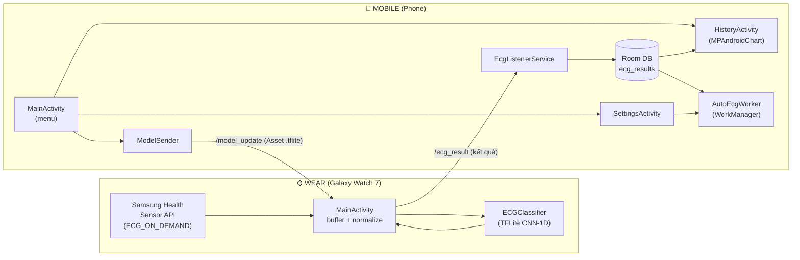
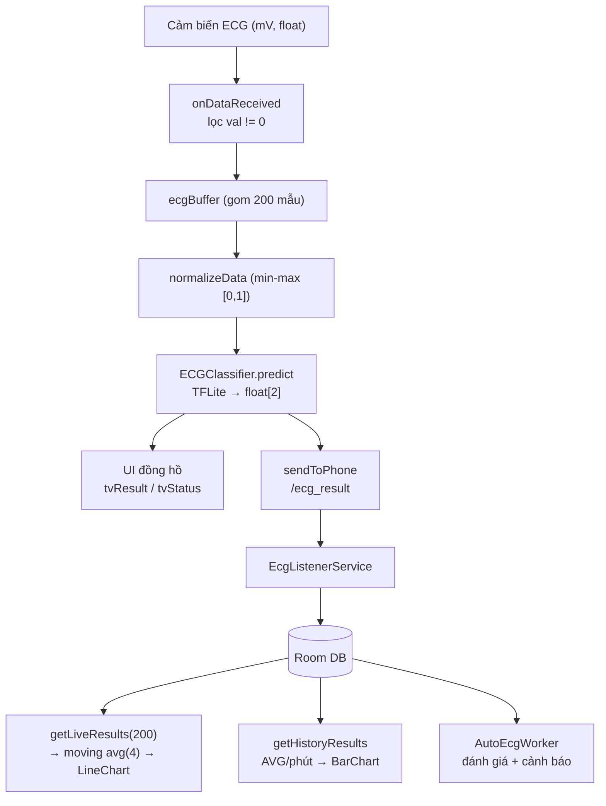
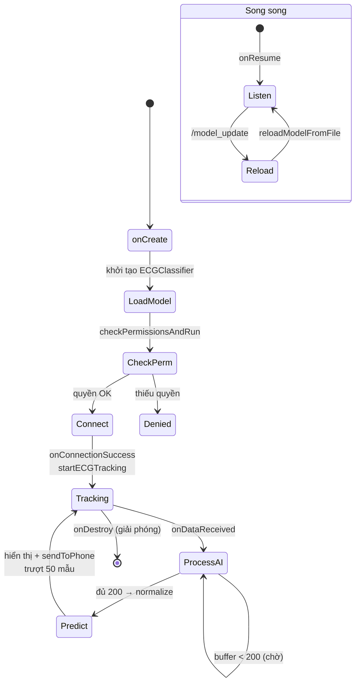

# 09 — Sơ đồ tổng quan

[← Quay lại mục lục](README.md)

> Các sơ đồ dùng cú pháp **Mermaid** (render được trên GitHub, VS Code + plugin, hoặc mermaid.live). Kèm bản ASCII cho môi trường không hỗ trợ.

## Kiến trúc hệ thống & quan hệ module



## Luồng dữ liệu



## Luồng xử lý (state machine — phía đồng hồ)



## Bản ASCII — kiến trúc tổng thể

```
        ┌───────────────────────────┐        Wearable Data Layer         ┌──────────────────────────────┐
        │      WEAR (Galaxy Watch)   │      (DataItem qua BT / Wi-Fi)     │        MOBILE (Phone)         │
        │                           │                                     │                              │
        │  Samsung Health Sensor API│                                     │  ┌────────────────────────┐  │
        │            │              │                                     │  │  MainActivity (menu)   │  │
        │            ▼              │      "/model_update" (Asset)        │  │   ├─ ModelSender ──────┼──┼──► gửi .tflite
        │  ┌──────────────────┐     │  ◄──────────────────────────────────┼──┤   ├─ btnHistory        │  │
        │  │   MainActivity   │     │                                     │  │   └─ btnSettings       │  │
        │  │ (buffer+normalize)│    │      "/ecg_result" (kết quả)        │  └────────────────────────┘  │
        │  │        │         │     │  ──────────────────────────────────►│  ┌────────────────────────┐  │
        │  │        ▼         │     │                                     │  │  EcgListenerService    │  │
        │  │  ECGClassifier   │     │                                     │  │        │ insert        │  │
        │  │  (TFLite CNN-1D) │     │                                     │  │        ▼               │  │
        │  └──────────────────┘     │                                     │  │  Room DB (ecg_results) │  │
        │                           │                                     │  │   │            │        │  │
        └───────────────────────────┘                                     │  │   ▼            ▼        │  │
                                                                          │  │ AutoEcgWorker  HistoryActivity
                                                                          │  │ (WorkManager)  (MPAndroidChart)
                                                                          │  │  + Cảnh báo    Live/History  │
                                                                          │  └────────────────────────┘  │
                                                                          │        ▲ SettingsActivity      │
                                                                          └──────────────────────────────┘
```

---

[← Quay lại mục lục](README.md)